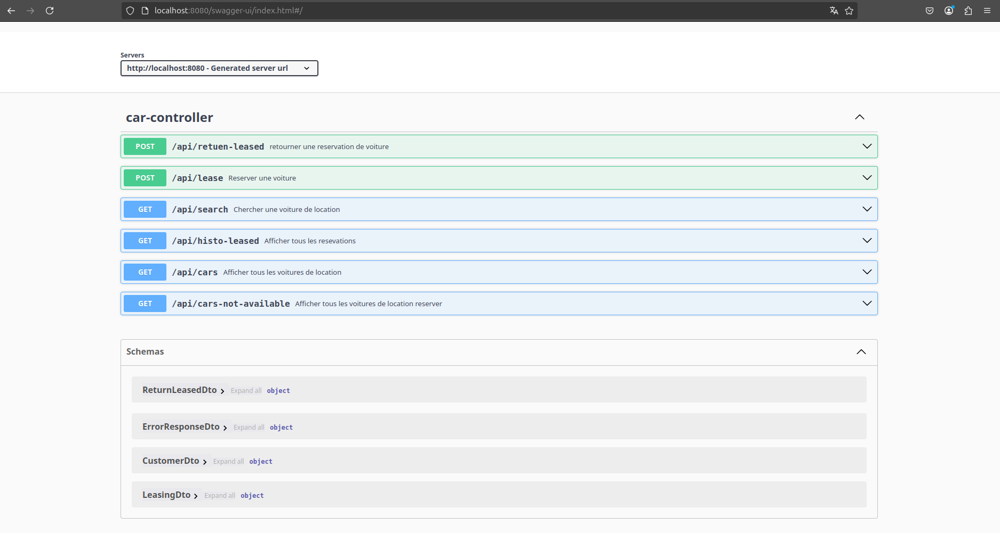

# KATA Location de voitures

API permettant de louer une voiture ou de mettre sa voiture a louer.

## Table des matières

Info générale
Technologies
Installation
Fonctionnalités
Contact

## Spécification technique et fonctionnelle

Ceci une solution API de location de Voitures en ligne qui offre les fonctions basique de fonctionnement de location de voitures à savoir chercher une Voiture, rendre une voiture, avec des regles de gestion de base et simple.

Les CRUDs pour cette version du projet sont les suivants :
* Recuperation des voitures disponible et voiture non disponible.
* Pagination des voitures de reservation
* Creation des jeux de donnée pour le model voiture.
* Creation de nouveau client
* Recuperation des clients
* Sauvegarder une reservation

### _Règles de gestion_

1. Validation des données front telles que :

* Voiture déjà réservée.
* Dates
* Mauvaise demande.
* Erreur d'une entité non valide ou qui n'existe pas

Codes d'erreurs specifique, en plus HTTP response status codes (200,404,500 ...)
CAR_NOT_FOUND(4004),
LEASING_NOT_VALID(1001),
RETURN_LEASED_NOT_VALID(1002),
LEASING_ALREADY_IN_USE(1003)

2. Gestion d'exception fonctionnelle.
Enlever des exceptions si une voiture n'existe 

3. Calculer le total de reservation
tarif de location * le nombre de jours (quantité)

4. Rendre une voiture; 
Libérer voiture pour qu’elle soit disponible.

## Technologies

Java 21  
Spring Boot version 3.4.2  
H2 comme base de donnée

# Architecture technique 
L'API de location de voiture est constituée de plusieurs modules, permettant d'être maintenable et évolutive.

Les différents modules réalisés dans cette version:

* configuration : Class de configuration de l'api
* controllers : Liste des URLS exposés pour les différents consommateurs
* dto : Les objets porteur de l'information
* enumes
* exceptions : Les différentes class pour la gestion et la définition des exceptions
* models : Création des entités de donnée ORM
* populators : Package pour l'isolation de données, la conversion ou le mapping des models vers les DTO ou l'inverse.
* repositories : Package DTO basée sur Spring data JPA
* serices : Package des service
* utils : Package Utilitaires
* validators : Package de validation des données DTO
* test : package de test TU et d'integration

## Installation

Depuis le répertoire racine de l'application _api-carservice_ et tapez la commande suivante pour l'exécuter : 

`mvn clean install
`

## Téléchargement du projet

Clone HTTP a partir de gitlab en suivant le lien suivant : https://gitlab.com/fr_kata_sf/c4-SF-0277-DE01

## Démarrage

Pour démmarer le projet  :

git checkout main

Pour démarrer le projet :
Entrez la commande suivante dans un terminal:
`mvn spring-boot:run
`  
par defaut le port server est : 8080

Dans un navigateur, allez à l'adresse http://localhost:8080/swagger-ui/index.html#/ pour voir l'ensemble des services de l'API.

## ScreenShots
/api/search

/api/cars (avec pagination)

/api/lease

/api/cars-not-available

/api/histo-leased

/api/retuen-leased
